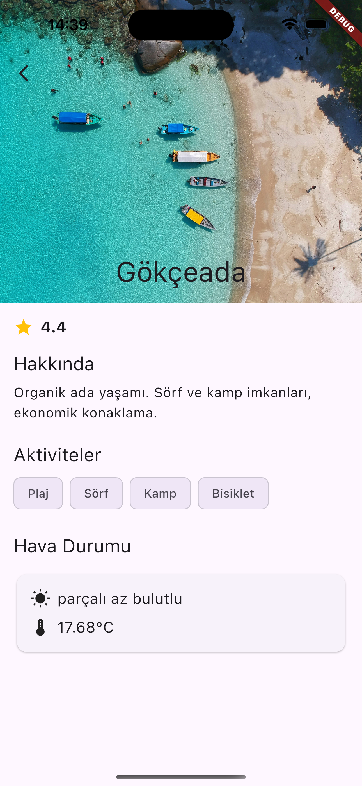
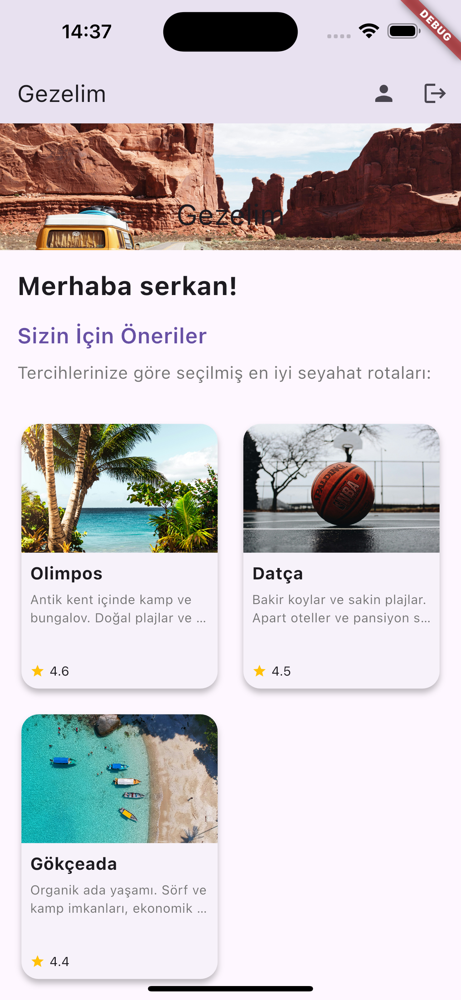

# Gezelim

Gezelim, kullanıcıların seyahat tercihlerini belirleyerek onlara uygun seyahat önerileri sunan bir mobil uygulamadır.

## 📌 Özellikler

- ✈️ Kullanıcı tercihleri doğrultusunda kişiselleştirilmiş seyahat önerileri
- 💰 Farklı bütçe ve süre seçenekleri ile esnek planlama
- 🏞️ Doğa, kültür, plaj ve macera kategorileri ile zengin içerik

## 🛠️ Kurulum

1. Projeyi klonlayın:
   ```bash
   git clone https://github.com/serondev/Gezelim.git
   ```

2. Gerekli bağımlılıkları yükleyin:
   ```bash
   flutter pub get
   ```

3. Uygulamayı çalıştırın:
   ```bash
   flutter run
   ```

## 📸 Ekran Görüntüleri

<center>

</center>

| Ana Ekran | Kategoriler | Öneriler |
|-----------|------------|----------|
|  |  |  |

---

Bu projeye katkıda bulunmak için lütfen bir `pull request` gönderin veya herhangi bir geri bildiriminiz varsa bizimle iletişime geçin! 🚀

