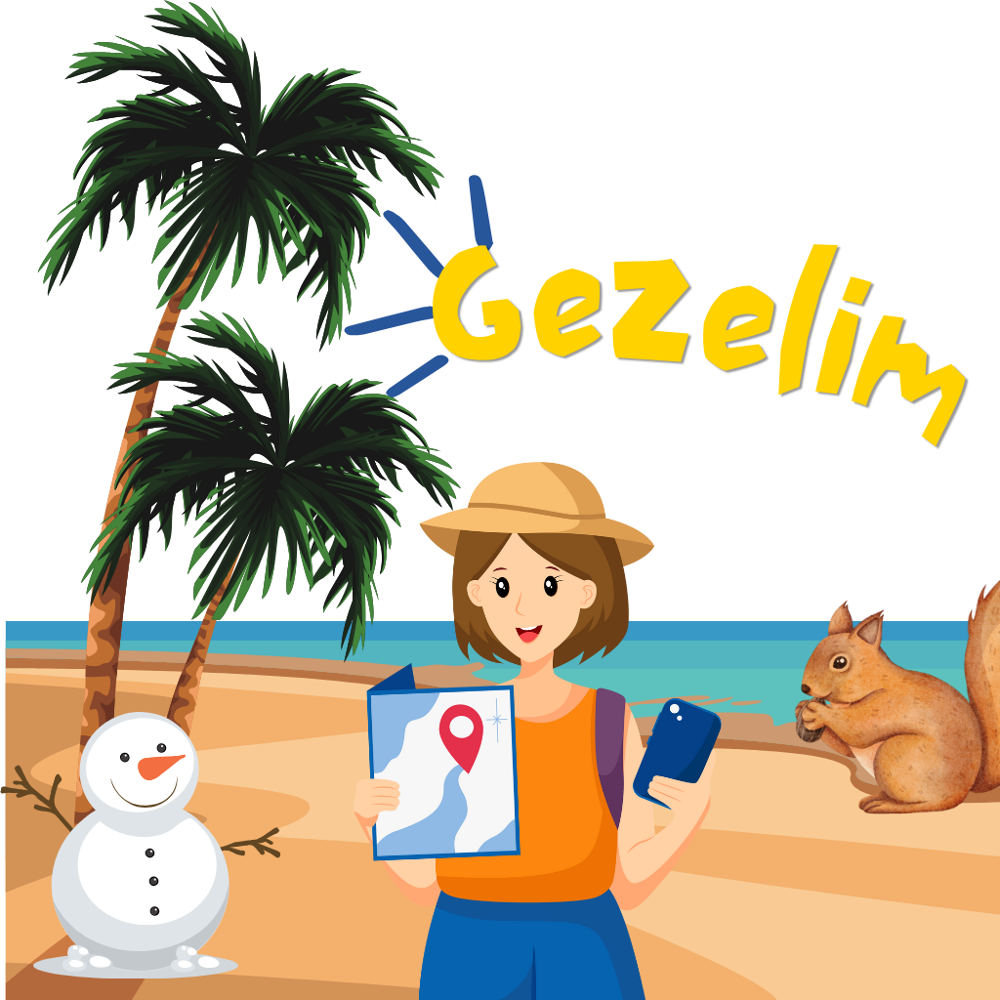

# Gezelim

Gezelim, kullanıcıların seyahat tercihlerini belirleyerek onlara uygun seyahat önerileri sunan bir mobil uygulamadır.

# Proje Özeti: Gezelim Mobil Uygulaması

## 📌 Proje Hakkında
Gezelim, kullanıcıların seyahat tercihlerini belirleyerek onlara uygun seyahat önerileri sunan bir mobil uygulamadır. Uygulama, kullanıcıların anketler aracılığıyla tercihlerini toplar ve bu verilere dayanarak önerilerde bulunur. Ayrıca, kullanıcıların profil bilgilerini yönetmelerine ve hava durumu bilgilerini görüntülemelerine olanak tanır.

## 🛠️ Kullanılan Teknolojiler ve Özellikler

### Flutter
- **Çapraz Platform Geliştirme**: Uygulama, Flutter framework'ü kullanılarak geliştirilmiştir. Bu sayede hem Android hem de iOS platformlarında çalışabilen tek bir kod tabanı oluşturulmuştur.
- **Widget Tabanlı Yapı**: Flutter'ın widget tabanlı yapısı sayesinde, kullanıcı arayüzü bileşenleri kolayca oluşturulmuş ve özelleştirilmiştir.
- **State Management**: Uygulama, kullanıcı durumunu yönetmek için `Provider` paketini kullanmaktadır. Bu, uygulamanın durumunu yönetmeyi ve bileşenler arasında veri paylaşımını kolaylaştırır.

### Mobil Geliştirme Özellikleri
- **Hava Durumu API Entegrasyonu**: Uygulama, OpenWeatherMap API'si kullanarak hava durumu bilgilerini alır ve kullanıcıya gösterir. Bu, kullanıcıların seyahat planlarını yaparken hava durumunu göz önünde bulundurmalarına yardımcı olur.
- **Veritabanı Yönetimi**: Kullanıcı bilgilerini ve seyahat önerilerini saklamak için SQLite veritabanı kullanılmıştır. `sqflite` paketi ile veritabanı işlemleri gerçekleştirilmiştir.
- **Kullanıcı Profili Yönetimi**: Kullanıcılar, profil bilgilerini güncelleyebilir ve kaydedebilir. Bu bilgiler, uygulama içinde kişiselleştirilmiş deneyimler sunmak için kullanılır.
- **Anket ve Öneri Sistemi**: Kullanıcıların seyahat tercihlerini belirlemek için anketler oluşturulmuş ve bu verilere dayanarak öneriler sunulmuştur. `TravelViewModel` sınıfı, anket sorularını yönetir ve kullanıcı yanıtlarını işler.

### Android ve iOS Özellikleri
- **Platforma Özgü Özellikler**: Uygulama, hem Android hem de iOS platformlarında çalışacak şekilde tasarlanmıştır. `flutter_launcher_icons` paketi ile uygulama simgeleri her iki platform için özelleştirilmiştir.
- **Kamera ve Galeri Erişimi**: Kullanıcıların profil fotoğraflarını yüklemeleri için cihazın kamerasına ve galeriye erişim sağlanmıştır. `image_picker` paketi bu işlevselliği sağlar.
- **Yerel Bildirimler**: Uygulama, kullanıcıların seyahat önerileri ve güncellemeleri hakkında bilgilendirilmesi için yerel bildirimler kullanabilir.

### Kullanıcı Arayüzü
- **Responsive Tasarım**: Uygulama, farklı ekran boyutlarına uyum sağlayacak şekilde tasarlanmıştır. `MediaQuery` ve `LayoutBuilder` kullanılarak ekran boyutuna göre bileşenlerin boyutları ayarlanmıştır.
- **Görsel ve Etkileşimli Bileşenler**: Uygulama, kullanıcı deneyimini artırmak için görsel bileşenler (örneğin, `SliverAppBar`, `LinearProgressIndicator`, `Chip`) ve etkileşimli düğmeler kullanmaktadır.

## 📸 Uygulama Önizleme

## 🎯 Sonuç
Gezelim uygulaması, kullanıcıların seyahat deneyimlerini kişiselleştirmek ve geliştirmek için modern mobil geliştirme tekniklerini kullanarak tasarlanmıştır. Flutter'ın sağladığı avantajlar sayesinde, uygulama hem Android hem de iOS platformlarında sorunsuz bir şekilde çalışmaktadır. Kullanıcıların ihtiyaçlarına yönelik özellikler ve işlevsellikler eklenerek, kullanıcı deneyimi en üst düzeye çıkarılmıştır. Bu proje, mobil uygulama geliştirme konusundaki yetkinliklerinizi ve becerilerinizi sergilemek için mükemmel bir örnektir.

---

Bu projeye katkıda bulunmak için lütfen bir `pull request` gönderin veya herhangi bir geri bildiriminiz varsa bizimle iletişime geçin! 🚀

